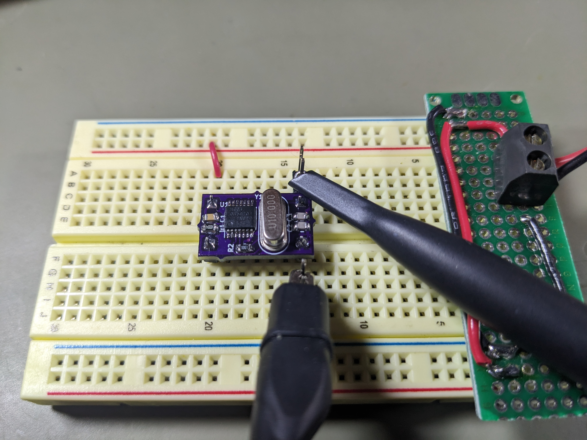
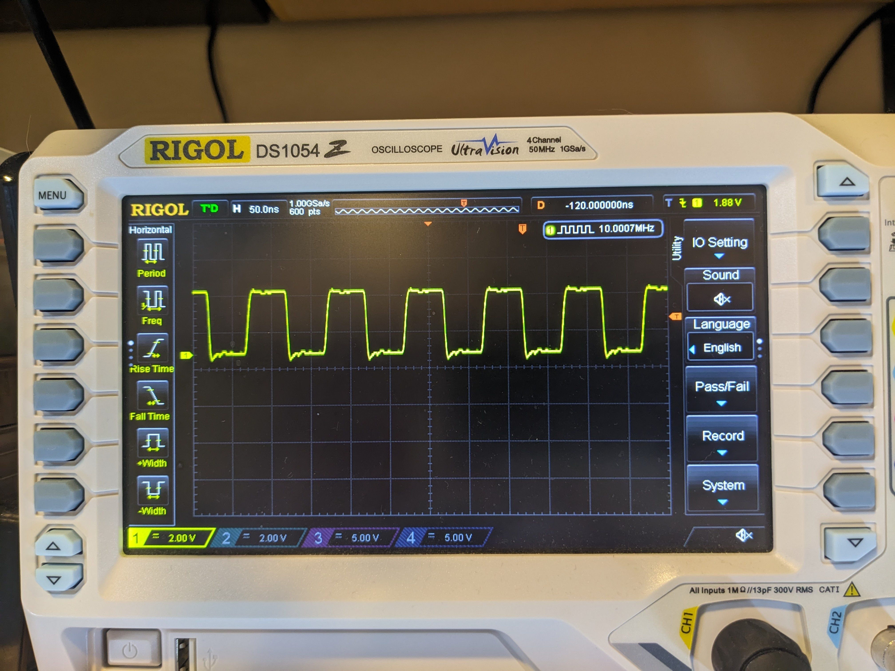

# Oscillator PCB

This project started because I needed a 10 MHz oscillator that could run with
VCC at 3.3V to provide a clock signal to a 3.3V FPGA. I do have some
10 MHz full-can oscillators, but I don't have a datasheet for them, and
it's not clear whether they are rated to run at 3.3V. So, I designed a
small PCB with the same pinout as a full-can oscillator which
uses a surface mount 74HC04 and a low-profile HC-49US through-hole crystal
to generate a 10 MHz square wave.

The schematic and PCB design were (of course!) created using [KiCad](https://www.kicad.org/).

Obligatory photo:

The assembled module is *approximately* the same size as a standard full-can oscillator,
and has the same pin spacing. Note that unlike a "real" oscillator,
pin 1 isn't an input that you can ground to disable the clock
output, so if you need that functionality, this module won't work.

It produces a reasonable 10 MHz square wave:

Parts list:

Symbol | Part | Note
------ | ---- | ----
R1 | 1 MΩ 0805 resistor |
R2 | 1 kΩ 0805 resistor |
C1 | 100 nF 0805 capacitor | decoupling for the 74HC04
C2, C3 | 22 pF 0805 capacitor | loading caps
U1 | 74HC04 in a TSSOP-14 package | inverters for oscillator, output
Y1 | 10 MHz HC-49US low-profile crystal (parallel resonance) |
J1–J4 | Male header pins | whatever kind you prefer, I like the round ones

The resistors and capacitors are 0805 package (imperial measurement).
I got most of the components from [LCSC](https://www.lcsc.com/).
The boards were fabbed by [OSHPark](https://www.oshpark.com/).
(You can just upload [Oscillator.kicad\_pcb](Oscillator.kicad_pcb)
to OSHPark, no need to generate Gerbers, drill files, and whatnot.)

The circuit will likely work with other crystal frequencies
(I think you would just need to select loading capacitors appropriately

I'm not particularly skilled at surface mount soldering, but I had no
trouble assembling these. I used drag soldering with lots of flux gel for
the 74HC04, with only tiny amounts of solder on the tip of the iron.
For the resistors and capacitors, I melted solder onto one pad,
used tweezers to position the component (with the solder melted),
then soldered the other pad.

## License

This board is made available as public domain (CC0). I provide no guarantee that
it will do anything useful: use it at your own risk.

<a property="dct:title" rel="cc:attributionURL" href="https://github.com/daveho/Oscillator">Oscillator PCB</a> by <a rel="cc:attributionURL dct:creator" property="cc:attributionName" href="https://daveho.github.io/">David Hovemeyer</a> is marked with <a href="http://creativecommons.org/publicdomain/zero/1.0?ref=chooser-v1" target="_blank" rel="license noopener noreferrer" style="display:inline-block;">CC0 1.0</a>
 
